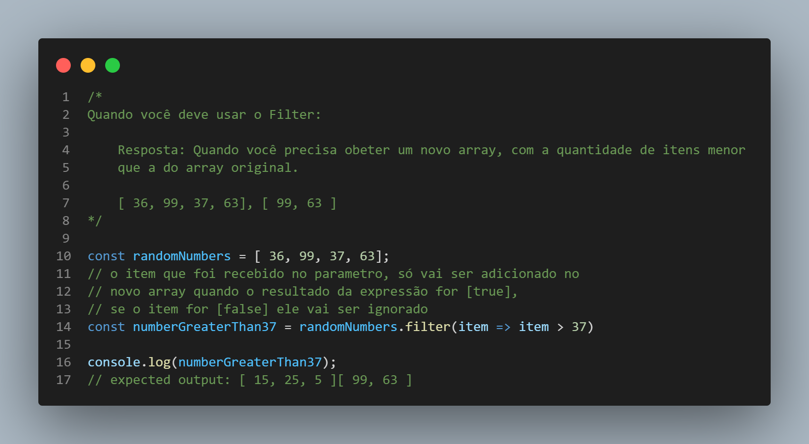

#  Quando devo usar o método filter()?

Deve usa-lo você precisa obeter um novo array, com a quantidade de itens menor que a do array original.
exemplo: Array Original [ 36, 99, 37, 63] e quero um novo Array que filtre os números maiores que 37.

Então o Novo Array vai ser [ 99, 63 ]

O método filter() cria um novo array com todos os elementos que passaram no teste implementado pela função fornecida.

filter() chama a função callback fornecida, uma vez para cada elemento do array, e constrói um novo array com todos os valores para os quais o callback retornou o valor true ou um valor que seja convertido para true.

# Exercício do método filter();
```
/*
  Exercício
  - Utilizando o array abaixo, gere um novo array com apenas os filmes 
    lançados antes do ano 2000;
  - Exiba o novo array no console.
*/

const tarantinoMovies = [
  { name: 'Bastardos inglórios', release: 2009 },
  { name: 'Pulp Fiction', release: 1994 },
  { name: 'Kill Bill: Volume 2', release: 2004 },
  { name: 'Quatro Quartos', release: 1995 },
  { name: 'Sin City', release: 2005 },
  { name: 'Era uma Vez em... Hollywood', release: 2019 },
  { name: 'Django Livre', release: 2012 },
  { name: 'Cães de Aluguel', release: 1992 },
  { name: 'À Prova de Morte', release: 2007 },
  { name: 'Kill Bill: Volume 1', release: 2003 }
]
```

# ScreenShot

## 
<p align="center">

</p>

<h1 align="center">💻 Desenvolvido Por: Gilberto Júnior</h1>